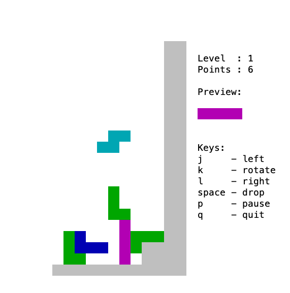

# RefOSの実行メモ

- master(2016/9/19)はsel_toolsのディレクトリ構成が変わっており使用不可
- working.xmlを使用する
- toolsコードがphython2
  - print関数, 割り算, 論理演算で変更が必要

## ビルド

```bash
$ mkdir refos && cd refos
$ repo init -u https://github.com/seL4/refos-manifest.git -m working.xml
  # -m オプションでピン留めマニュフェストを指定
$ repo sync
$ make help
RefOS - Reference Design For A Microkernel Based Operating System

 make help                   - Show this help menu.
 make menuconfig             - Select build configuration via menus.
 make <defconfig>            - Apply one of the default configurations. See
                               below for valid configurations.
 make silentoldconfig        - Update configuration with the defaults of any
                               newly introduced settings.
 make                        - Build everything with the current configuration.
 make generate-rpc           - Generate RPC stubs from XML specifications.
 make clean-rpc              - Delete generated RPC stubs.
 make refos                  - Build RefOS without re-generating RPC stub code.
 make cscope                 - Build cscope.out index file using cscope.
 make docs                   - Build docs/html/ Doxygen code documentation.
 make design                 - Build protocol design document.
 make simulate-kzm           - Boot kzm configured system image.
 make simulate-ia32          - Boot ia32 configured system image.
 make simulate-ia32-graphics - Boot ia32 configured system image in new console.


Valid default configurations are:
	ia32_debug_defconfig
	ia32_debug_test_defconfig
	ia32_release_defconfig
	ia32_release_test_defconfig
	ia32_screen_debug_defconfig
	ia32_screen_release_defconfig
	imx6_debug_defconfig
	imx6_debug_test_defconfig
	imx6_release_defconfig
	imx6_release_test_defconfig
	kzm_debug_defconfig
	kzm_debug_test_defconfig
	kzm_release_defconfig
	kzm_release_nethack_defconfig
	kzm_release_test_defconfig

$ make kzm_debug_test_defconfig
  # Makefileにかかれているconfigを選択 (arm32)
$ make silentoldconfig
$ make
./refos_cidl_compile make proc
  File "/home/vagrant/refos/./cidl_compile", line 189
    print TITLE_MESSAGE										// これはpython2の文法
    ^^^^^^^^^^^^^^^^^^^
SyntaxError: Missing parentheses in call to 'print'. Did you mean print(...)?
make: *** [Makefile:70: generate-rpc] Error 1
$ vi cidl_compile
#    189     print(TITLE_MESSAGE)
#    190     print(tempita.Template(template_root).substitute(dct_root))
$ make
./refos_cidl_compile make proc
Traceback (most recent call last):
  File "/home/vagrant/refos/./cidl_compile", line 15, in <module>
    import sys, tempita, re, argparse
ModuleNotFoundError: No module named 'tempita'
make: *** [Makefile:70: generate-rpc] Error 1
$ sudo apt install python3-tempita
$ make
./refos_cidl_compile make proc
./refos_cidl_compile make name
./refos_cidl_compile make serv
./refos_cidl_compile make data
[libs/libmuslc] building...
/home/vagrant/refos/libs/libmuslc/src/unistd/getcwd.c: In function ‘getcwd’:
cc1: warning: function may return address of local variable [-Wreturn-local-add]
/home/vagrant/refos/libs/libmuslc/src/unistd/getcwd.c:9:14: note: declared here
    9 |         char tmp[PATH_MAX];
      |              ^~~
[libs/libmuslc] done.
[libs/libsel4] building...
 [GEN] include/interfaces/sel4_client.h
  File "/home/vagrant/refos/libs/libsel4/tools/syscall_stub_gen.py", line 847
    print "Invalid word size in configuration file."
    ^^^^^^^^^^^^^^^^^^^^^^^^^^^^^^^^^^^^^^^^^^^^^^^^
SyntaxError: Missing parentheses in call to 'print'. Did you mean print(...)?
make[1]: *** [/home/vagrant/refos/libs/libsel4/Makefile:122: include/interfaces/sel4_client.h] Error 1
make: *** [tools/common/project.mk:309: libsel4] Error 2
$ vi libs/libsel4/tools/syscall_stub_gen.py			// print関数にカッコを付ける
$ make
...
 [GEN] include/interfaces/sel4_client.h
/home/vagrant/refos/libs/libsel4/tools/syscall_stub_gen.py:852: SyntaxWarning: "is" with a literal. Did you mean "=="?
  if wordsize is -1:
Traceback (most recent call last):
  File "/home/vagrant/refos/libs/libsel4/tools/syscall_stub_gen.py", line 861, in <module>
    sys.exit(main())
  File "/home/vagrant/refos/libs/libsel4/tools/syscall_stub_gen.py", line 857, in main
    generate_stub_file(args.arch, wordsize, args.files, args.output, args.buffer)
  File "/home/vagrant/refos/libs/libsel4/tools/syscall_stub_gen.py", line 787, in generate_stub_file
    result.append(generate_stub(arch, wordsize, interface_name, method_name,
  File "/home/vagrant/refos/libs/libsel4/tools/syscall_stub_gen.py", line 545, in generate_stub
    input_expressions = generate_marshal_expressions(standard_params, num_mrs,
  File "/home/vagrant/refos/libs/libsel4/tools/syscall_stub_gen.py", line 412, in generate_marshal_expressions
    generate_param_code(param, first_bit, num_bits, words, wordsize)
  File "/home/vagrant/refos/libs/libsel4/tools/syscall_stub_gen.py", line 385, in generate_param_code
    word_array[target_word].append(expr)
TypeError: list indices must be integers or slices, not float
make[1]: *** [/home/vagrant/refos/libs/libsel4/Makefile:122: include/interfaces/sel4_client.h] Error 1
make: *** [tools/common/project.mk:309: libsel4] Error 2

$ vi libs/libsel4/tools/syscall_stub_gen.py
// 論理演算: is => ==
// 割り算切り捨て: '/' => '//'

$make
...
 [CC] kernel_final.s
In file included from /home/vagrant/refos/kernel/src/arch/arm/32/kernel/thread.c:15:
/home/vagrant/refos/kernel/include/arch/arm/arch/kernel/thread.h:19:1: error: ‘const’ attribute on function returning ‘void’ [-Werror=attributes]
   19 | void CONST Arch_activateIdleThread(tcb_t *tcb);
      | ^~~~
/home/vagrant/refos/kernel/src/arch/arm/32/kernel/thread.c:41:1: error: ‘const’ attribute on function returning void’ [-Werror=attributes]
   41 | {
      | ^
cc1: all warnings being treated as errors
make[1]: *** [/home/vagrant/refos/kernel/Makefile:583: kernel_final.s] Error 1
$ vi kernel/include/arch/arm/arch/kernel/thread.h
$ vi kernel/src/arch/arm/32/kernel/thread.c
// void CONSTのCONSTを削除

$ make
...
 [LINK] elfloader.o
 [STAGE] elfloader.o
 [STAGE] archive.bin.lds
 [STAGE] linker.lds
 [STAGE] gen_boot_image.sh
[elfloader] done.
Generating boot image: /home/vagrant/refos/images/refos-image   // ビルド成功
$ ls images
refos-image
$ make simulate-kzm
qemu-system-arm -nographic -M kzm \
	-kernel images/refos-image

ELF-loader started on CPU: ARM Ltd. ARMv6 Part: 0xb36 r1p3
  paddr=[82000000..8268ffff]
ELF-loading image 'kernel'
  paddr=[80000000..80031fff]
  vaddr=[f0000000..f0031fff]
  virt_entry=f0000000
ELF-loading image 'process_server'
  paddr=[80032000..80863fff]
  vaddr=[10000..841fff]
  virt_entry=2a790
Enabling MMU and paging
Jumping to kernel-image entry point...

Bootstrapping kernel
[00.0] PROCSERV |  initialise_welcome_message(): ================= RefOS Version 2.0 =================
[00.1] PROCSERV |  initialise_welcome_message():   Built on Jun 10 2023 09:43:00.
[00.2] PROCSERV |  initialise_welcome_message():   © Copyright 2016 Data61, CSIRO
[00.3] PROCSERV |  initialise_welcome_message(): =====================================================
...
 ______     ______     ______   ______     ______
/\  == \   /\  ___\   /\  ___\ /\  __ \   /\  ___\
\ \  __<   \ \  __\   \ \  __\ \ \ \/\ \  \ \___  \
 \ \_\ \_\  \ \_____\  \ \_\    \ \_____\  \/\_____\
  \/_/ /_/   \/_____/   \/_/     \/_____/   \/_____/

-----------------------------------------------------
    Built on the seL4 microkernel.
    (c) Copyright 2016 Data61, CSIRO
-----------------------------------------------------
refos:/$

$ help
RefOS Terminal Help:
    clear - Clear the screen.
    help - Display this help screen.
    exec - Run an executable.
    exec fileserv/tetris - Run tetris game.
    exec fileserv/snake - Run snake game.
    exec fileserv/test_user - Run RefOS userland tests.
    exec fileserv/terminal - Run another instance of RefOS terminal.
    cd /fileserv/ - Change current working directory.
    printenv - Print all environment variables.
    setenv - Set an environment variable.
    time - Display the current system time.
    exit - Exit RefOS terminal.
refos:/$ printenv
SHELL=/fileserv/terminal
PWD=/
TZ=AEST-10
refos:/$ time
Raw epoch time is 89
Current GMT time is Thursday, January  1 00:01:29 1970
Current local time (AEST-10) is Thursday, January  1 10:01:29 1970
refos:/$ exec fileserv/tetris
...
```

[実行ログ](refos.log)



## デザイン文書の作成

[デザイン文書](refos_docs/design.pdf)

```bash
$ sudo apt install texlive-latex-base mscgen texlive-latex-extra texlive-fonts-recommended
$ sudo apt install sudo apt install texlive-font-utils    # epstopdf
$ make desing
...
[DESIGN] OK. Please open file '/home/vagrant/refos/projects/refos/design/paper.pdf'
```

## Doxygenコードドキュメントの作成

[コードドキュメント](refos_docs/html/index.html)

```bash
$ make docs
```
